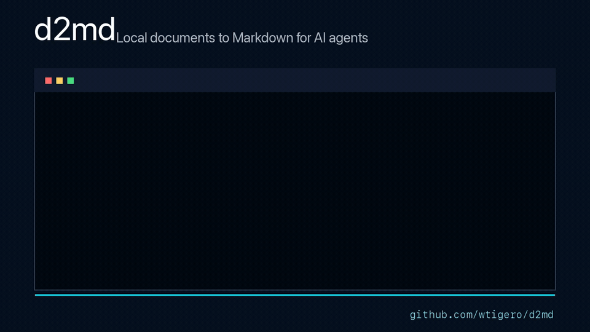

# d2md

Convert local documents to Markdown for reading, search, RAG, scripts, and AI
agents. The default path stays lightweight; OCR and Docling run only when both
installed and explicitly requested.



- Convert one file or a whole directory tree.
- Read normal PDFs without loading an ML stack.
- OCR scanned PDFs and images only with `--ocr`.
- Use Docling for layout, reading order, headings, and tables only with
  `--docling`.
- Preserve legacy Thai TIS-620/CP874 text and detect measured Thai PDF damage.
- Fail explicitly on empty output, unavailable languages, and unsafe paths.

Conversion runs locally. On macOS, direct `--ocr` uses Apple Vision supplied by
macOS, with no API key and no separate OCR model or weight download. RapidOCR
on Linux or Windows and Docling on every platform may retrieve model files on
their first explicit use.

> **macOS highlight: accurate OCR without a model download.** Install the OCR
> profile once and direct `--ocr` uses Apple Vision supplied by macOS, locally—no
> API key and no separate OCR model or weight download. In the promoted
> benchmark for commit [`7203499`](https://github.com/wtigero/d2md/blob/v0.1.1/bench/results/7203499e58bf8e6415b3190638d0f8a689f55924/README.md),
> direct Apple Vision OCR measured `0` to `0.0299` no-space character error
> rate (`0%` to `2.99%`) across ten clean fixtures, including Thai at `0.0034`
> (`0.34%`). This is historical, commit-pinned, fixture-bounded evidence rather
> than a claim about every document or a current-CI accuracy result. It applies
> to direct `--ocr`; Docling remains an optional, model-backed profile.

## Choose a mode

Start with the lightest mode that fits the document:

| Need | Install profile | Command |
|---|---|---|
| Text already present in PDF, Office, web, or text files | Base | `d2md report.pdf` |
| Scanned PDF or image | OCR | `d2md scan.pdf --ocr` |
| Layout, headings, reading order, or tables | Docling | `d2md report.pdf --docling` |
| A scanned document with Docling structure | Docling | `d2md scan.pdf --docling --ocr` |
| Markdown for an AI or shell pipeline | Matching profile | `d2md report.pdf --stdout` |
| A machine-readable batch report | Matching profile | `d2md documents/ --json` |

Installing an optional profile never changes an ordinary command. The flags
still decide which capability is allowed to run.

## Minimum requirements and tested resource floor

Python 3.10 through 3.13 is supported. Every profile works on CPU; a GPU is not
required. MPS, CUDA, and XPU are optional device selections for Docling only;
the published hardware evidence covers MPS and CUDA, not XPU. Direct OCR does
not load PyTorch.

| Profile | Minimum execution path | First-use model data |
|---|---|---|
| Base | Supported Python and CPU | None |
| Direct OCR on macOS | CPU plus Apple Vision | No separate OCR model download |
| Direct OCR on Linux or Windows | CPU | RapidOCR weights may be retrieved |
| Docling | CPU; acceleration is optional | Docling artifacts may be retrieved |

The [lowest-memory tested system](https://github.com/wtigero/d2md/blob/v0.1.1/docs/verification.md#hardware-and-relevant-packages)—not
a minimum requirement—was an Apple M3 with 16 GiB RAM. Base, direct Apple
Vision OCR, Docling CPU, and Docling MPS all passed there. Lower-memory hosts
may work but have not been qualified, and no fixed RAM or storage minimum is
claimed because document size and the selected backend dominate both. Leave
additional disk space for optional model caches, and retain the built-in
[safety limits](#safety-limits) for untrusted input.

## Quick start: normal documents

Install the base tool from PyPI:

```bash
uv tool install d2md
d2md report.pdf --stdout
```

Or install it into an existing Python environment:

```bash
pip install d2md
```

This reads text already present in PDFs, Office/web documents, and text files.
It does not run OCR or load Docling.

Convert a directory tree or choose another output directory:

```bash
d2md ~/Documents
d2md ~/Documents -o converted
```

Output defaults to `md-out/`. For example, `reports/annual.pdf` becomes
`md-out/annual.md`.

## Use with AI and automation

No AI SDK, API key, or model is required. An AI tool can call the same local
CLI and choose one of two machine-friendly outputs.

### Get Markdown on standard output

Use `--stdout` when the next process needs the converted content itself:

```bash
d2md report.pdf --stdout
d2md scan.pdf --ocr --lang thai --stdout
d2md report.pdf --docling --stdout | your-ai-command
```

`--stdout` accepts exactly one collected input, writes no Markdown file, and
prints no progress text into the stream. Errors go to standard error and the
command exits non-zero. Because it does not write files, it cannot be combined
with `-o`, `--outdir`, or `--force`.

### Get a JSON run report

Use `--json` for batch automation and agents that need status, paths, backend,
timing, and errors:

```bash
d2md documents/ -o converted --json
d2md scans/ --ocr --lang thai -o converted --json
```

`--json` still writes Markdown files. Its standard output is one JSON object
and contains no human progress lines. Backend diagnostics, if any, go to
standard error:

```json
{
  "schema_version": 1,
  "ok": true,
  "options": {"device": "auto", "docling": false, "language": null, "ocr": false},
  "summary": {"converted": 1, "failed": 0, "skipped": 0},
  "results": [
    {
      "source": "report.pdf",
      "output": "md-out/report.md",
      "status": "converted",
      "backend": "pypdfium2",
      "characters": 12480,
      "seconds": 0.012345
    }
  ],
  "errors": [],
  "warnings": []
}
```

The schema is versioned. After valid argument parsing, a failed run keeps the
same envelope, sets `ok` to `false`, lists structured `errors`, and returns a
non-zero exit code.

### Let an AI inspect this machine

```bash
d2md --capabilities --json
```

This reports installed OCR engines, readable script groups, whether Docling is
installed, the accepted device choices, and exact commands for installing the
optional profiles. Capability discovery exits zero even when optional
components are absent, so an agent can inspect first and act without guessing.
For a shorter human-readable OCR-only view, run `d2md --engines`.

## OCR scanned documents

Install the OCR profile and opt in with `--ocr`:

```bash
uv tool install "d2md[ocr]"
d2md scan.pdf --ocr
```

If the base tool is already installed, replace its environment with the OCR
profile:

```bash
uv tool install --force "d2md[ocr]"
```

`--ocr` permits OCR for scanned PDFs and images. A healthy PDF with a usable
text layer still uses direct text extraction; it is not re-OCRed.

When the script is known, pass `--lang` to avoid extra detection passes:

```bash
d2md scan.pdf --ocr --lang thai
d2md scans/ --ocr --lang latin
```

Script groups are not language counts. One Latin model can cover several
languages, while Thai, Japanese, Chinese, Korean, Cyrillic, and Arabic require
separate script handling. Availability is platform-specific:

| Platform | Engine | Script groups exposed | Clean benchmark fixtures completed |
|---|---|---|---|
| macOS | Apple Vision through `ocrmac` | Latin, Thai, Japanese, Chinese, Korean, Cyrillic, Arabic | English, German, Vietnamese, Thai, Japanese, Simplified and Traditional Chinese, Korean, Russian, Arabic |
| Linux and Windows | RapidOCR | Latin, Japanese, Chinese | English, German, Vietnamese, Japanese, Simplified and Traditional Chinese |

“Completed” means the route ran and was scored, not that every result met an
accuracy threshold. Vietnamese on RapidOCR measured a no-space character error
rate of `0.1903`, so this project does not make a high-accuracy Vietnamese claim
for Linux or Windows.

Inspect the current installation rather than guessing from the table:

```bash
d2md --engines
d2md --capabilities --json
```

An unsupported script is refused before the first file; it is never silently
mapped to Latin. The error lists the scripts available on that installation.
Apple Vision is supplied by macOS and needs no separate OCR weight download.
RapidOCR may retrieve model files when a configured model is used for the first
time.

## Layout and tables with Docling

Use Docling when layout, heading, reading-order, or table reconstruction is
more important than the lightweight text-only route:

```bash
uv tool install "d2md[docling]"
d2md report.pdf --docling
d2md scan.pdf --docling --ocr
```

If another profile is already installed, add `--force` to the installation
command. The Docling profile includes the platform OCR dependencies.

`--docling` does not imply OCR. Add `--ocr` only for scans or images. Docling
may retrieve its model artifacts on first explicit use.

### NVIDIA CUDA

For NVIDIA CUDA, let `uv` select matching PyTorch wheels for the machine:

```bash
uv tool install --torch-backend auto "d2md[docling]"
```

Add `--force` when replacing an existing installation. If `auto` selects a
wheel that excludes an older Pascal GPU such as the GTX 10 series, select the
compatible CUDA 12.6 wheels explicitly:

```bash
uv tool install --force --torch-backend cu126 "d2md[docling]"
```

Keep torch and torchvision on the same backend build. The commands above let
`uv` resolve the pair together; replacing only one of them can break Docling
imports. `--torch-backend` requires a recent `uv` and is currently marked
experimental by `uv`.

Device selection belongs only to Docling. Direct OCR does not use `--device`:

```bash
d2md report.pdf --docling --device cpu
d2md scan.pdf --docling --ocr --device cuda
d2md scan.pdf --docling --ocr --device mps
```

Supported device names are `auto`, `cpu`, `cuda`, `mps`, and `xpu`. An
explicit unavailable accelerator is a strict error and does not fall back to
CPU.

## Installation notes

The package supports Python 3.10 through 3.13. To replace an existing profile,
repeat its command with `--force`.

### Source and release verification

For source installs or verifying the exact `v0.1.1` release tag, use:

```bash
uv tool install "d2md @ git+https://github.com/wtigero/d2md.git@v0.1.1"
```

Tags and public releases are promoted through the gates in
[docs/release-process.md](https://github.com/wtigero/d2md/blob/v0.1.1/docs/release-process.md).

For repository development, create an isolated environment and install the
test plus optional dependencies:

```bash
uv venv --python 3.12 .venv
uv pip install --python .venv/bin/python -e '.[dev,docling]'
.venv/bin/python -m pytest
```

## Formats and routing

Installed extras never change an unflagged command. Routing depends only on
the input type and explicit flags.

| Input or option | Route |
|---|---|
| `.txt .md .csv .json .xml .yaml .yml` | validated direct read |
| `.docx .xlsx .xls .pptx .html .htm .msg .epub` | MarkItDown |
| Healthy PDF without `--docling` | pypdfium2 text extraction |
| Scanned/damaged PDF with `--ocr` | direct page rendering plus the selected OCR engine |
| Image with `--ocr` | the selected OCR engine |
| PDF/image with `--docling` | Docling; OCR only when `--ocr` is also present |
| Explicit file (or library call) with an unknown non-archive extension | content-aware PDF/image preflight, then a MarkItDown attempt |
| Generic `.zip` or renamed ZIP archive | rejected; extract and pass a supported document directly |

A scanned PDF, damaged Thai text layer, or image without `--ocr` returns an
actionable error containing both the OCR installation command and required
flag. There is no automatic fallback into an installed optional stack.
Recursive directory discovery collects only known supported suffixes; it does
not apply the unknown-extension fallback.

## Command reference

```bash
d2md report.pdf
d2md --force -- *.xlsx *.pdf
d2md scans/ --ocr
d2md scans/ --ocr --lang thai
d2md reports/ --docling --device cpu
d2md report.pdf --stdout
d2md reports/ --json
d2md --capabilities --json
d2md --version
```

Put options before `--` when shell wildcards may expand to filenames beginning
with `-`, as in the example above. `--` (or a `./` prefix) disambiguates such
legal paths from options; an option-looking path never authorizes OCR, Docling,
or any other capability.

| Option | Behavior |
|---|---|
| `-o DIR`, `--outdir DIR` | write Markdown to `DIR` instead of `md-out` |
| `-f`, `--force` | replace an existing output safely |
| `-q`, `--quiet` | print failures and the final summary only |
| `--stdout` | convert exactly one input to Markdown on standard output; write no file |
| `--json` | write files normally and print one versioned JSON run report |
| `--ocr` | permit OCR for scanned PDFs and images |
| `--docling` | use Docling for PDF/image layout and tables |
| `--lang SCRIPT` | select the OCR script; requires `--ocr` |
| `--device MODE` | select the Docling device; non-default values require `--docling` |
| `--engines` | show locally available OCR engines and configured scripts |
| `--capabilities` | show OCR, Docling, and device capabilities; combine with `--json` for agents |
| `--version` | print the installed `d2md` version and exit |
| `--unsafe-unlimited` | disable resource ceilings for trusted inputs only |

The former `--fast` option is a hidden deprecated compatibility no-op for one
release. Direct PDF text extraction is now the default.

If multiple inputs have the same basename, the first output is kept unless
`--force` is used. The command exits non-zero if any input fails:

```bash
d2md ./inbox -o ./markdown || echo "some documents need attention"
```

## Safety limits

| Resource | Default limit |
|---|---:|
| Input file size | 100 MiB |
| Supported files | 10,000 |
| Discovered directory entries | 10,000 |
| Retained collection failures | 10,000 |
| PDF pages | 500 |
| Rendered pixels per page | 40 million |
| Rendered pixels per PDF | 400 million |
| Extracted/output characters, per file and per CLI run | 20 million |
| ZIP-based document members | 10,000 |
| ZIP-based expanded content | 500 MiB |

The three input-collection budgets are separate caps, not a combined total.
Except for them and the cumulative output-character cap, these ceilings apply
to each file independently. A directory run may therefore spend the input,
archive, page, pixel, and parser-work allowances again for every collected
file. Split untrusted trees into small batches and use OS-level time and memory
limits when a strict whole-run compute budget is required.

The CLI rejects links observed during input discovery, binds each selected
regular file to the identity collected for it, and safely reopens that file
before parsing. Do not recursively convert a directory tree that another
process can rename or replace while the run is in progress: portable directory
enumeration cannot pin every queued directory across the whole traversal. On
POSIX, output writes are directory-descriptor relative and atomic.
An output link is never followed; `--force` replaces the link itself rather
than its target. On Windows, use an output directory you control rather than
one below a shared attacker-writable parent: portable filesystem APIs cannot
hold the same kind of directory descriptor across the final write. Terminal
control characters in filenames and backend errors are escaped before display.

The output-character ceiling is enforced while plain text is decoded and before
an oversized direct-PDF page text layer is extracted, incrementally for direct
OCR, and cumulatively across files published by one CLI run. Automatic OCR
language detection can do extra sample rendering and inference before the final
PDF pixel tally; supply `--lang` to skip that detection for untrusted or tightly
budgeted jobs. MarkItDown and Docling full-string backends run in reusable,
independent Python workers. The worker enforces the output ceiling before the
long-lived caller accepts or materializes the result. A failure, timeout, or
protocol error discards that worker; a successful worker remains warm for reuse.
This is not a whole-host sandbox or a hard RAM/GPU boundary. Keep untrusted
Office/Docling jobs within the input and archive limits above, split hostile
files into small batches, and apply OS, container, or job-level time and memory
controls when a hard boundary is required.

The default MarkItDown and Docling backend job deadline is 30 minutes (1,800
seconds). Only the explicit trusted-input `--unsafe-unlimited` mode makes that
deadline unlimited; it does not turn the worker into a whole-host sandbox.

Preflight checks use the verified file content as well as its suffix. Renaming a
ZIP, PDF, or supported image therefore does not skip its archive, page, or pixel
checks. A ZIP-based Office document or EPUB must also contain the standard
markers for the family named by its suffix. Generic and masquerading ZIP
archives are rejected, and the fallback parser's recursive ZIP converter stays
disabled; extract an archive and pass the intended document directly.

For a known trusted archival job that exceeds these ceilings, use
`--unsafe-unlimited`. It disables only resource limits; link protections and
the platform-specific output safeguards above remain active.

## Manual verification

Synthetic examples cover every accepted extension. See
[examples/README.md](https://github.com/wtigero/d2md/blob/v0.1.1/examples/README.md) for the manifest and direct driver.
See the dated [manual verification results](https://github.com/wtigero/d2md/blob/v0.1.1/docs/verification.md) for the
tested operating systems, profiles, devices, and fixture counts.

Run isolated profiles on Linux or macOS:

```bash
./scripts/smoke-linux.sh --profile base
./scripts/smoke-linux.sh --profile ocr
./scripts/smoke-linux.sh --profile docling --device cpu
./scripts/smoke-linux.sh --profile docling --device cuda --require-gpu
./scripts/smoke-linux.sh --profile docling --device mps --require-gpu
```

Run the same profiles from Windows PowerShell:

```powershell
.\scripts\smoke-windows.ps1 -Profile Base
.\scripts\smoke-windows.ps1 -Profile Ocr
.\scripts\smoke-windows.ps1 -Profile Docling -Device cpu
.\scripts\smoke-windows.ps1 -Profile Docling -Device cuda -RequireGpu
```

The scripts use one full-test environment and a second profile-only
environment, print the imported package path, run dependency checks, and
verify expected markers. No CI is required for these manual release checks.

## Controlled performance measurements

The manual smoke checks above prove functionality; they are not speed claims.
The [production benchmark matrix](https://github.com/wtigero/d2md/blob/v0.1.1/bench/README.md) measures the current
explicit routes by operating system, CPU/accelerator device, document type,
method, and language. It records initialization separately from warm timing,
quality and resource metrics, and promotes results only after all six required
hardware runs validate against the same commit and fixture hashes rebuilt from
the clean promotion checkout.

The first promoted result covers commit
[`7203499`](https://github.com/wtigero/d2md/blob/v0.1.1/bench/results/7203499e58bf8e6415b3190638d0f8a689f55924/README.md):
219 scenarios across macOS CPU/MPS, Ubuntu CPU/GTX 1060 CUDA, and Windows
CPU/RTX 3090 Ti CUDA. All six runs used the same fixture hashes. There were no
unexpected conversion errors.

| Platform and device | Success | Explicitly unsupported |
|---|---:|---:|
| macOS CPU | 54 | 0 |
| macOS MPS | 19 | 0 |
| Ubuntu CPU | 46 | 8 |
| Ubuntu GTX 1060 CUDA | 15 | 4 |
| Windows CPU | 46 | 8 |
| Windows RTX 3090 Ti CUDA | 15 | 4 |

CPU runs contain the default, direct-OCR, and Docling routes. Accelerator runs
contain only Docling scenarios, so their smaller row counts are intentional.
Representative warm medians for the one-page synthetic fixtures are:

| Route and fixture | macOS CPU | macOS MPS | Ubuntu CPU | GTX 1060 CUDA | Windows CPU | RTX 3090 Ti CUDA |
|---|---:|---:|---:|---:|---:|---:|
| Born-digital PDF, default | 0.0008 s | — | 0.0009 s | — | 0.0105 s | — |
| Born-digital PDF, Docling | 0.294 s | 0.124 s | 0.480 s | 0.101 s | 1.688 s | 0.209 s |
| Scanned PDF, direct OCR | 0.062 s | — | 2.122 s | — | 4.457 s | — |
| Scanned PDF, Docling + OCR | 0.374 s | 0.191 s | 1.697 s | 1.159 s | 7.104 s | 5.028 s |

These are hardware-specific medians after warm-up, not promises for other
documents or machines. First Docling + OCR initialization on the image fixture
ranged from 13.3 seconds to 573.1 seconds across the six runs. The 573.1-second
Ubuntu CPU result included a 60-second PyTorch AVX2 probe timeout on that VM;
the corresponding warm median was 1.93 seconds. The promoted result contains
the exact timing range, operation count, quality score, and resource telemetry
for every document type, method, language, OS, and device.

The fixed OCR corpus contains English, German, Vietnamese, Thai, Japanese,
Simplified Chinese, Traditional Chinese, Korean, Russian, and Arabic. Direct
Apple Vision OCR completed all ten clean fixtures with no-space character error
rates from 0 to 0.0299. RapidOCR on Ubuntu and Windows completed English,
German, Vietnamese, Japanese, and both Chinese fixtures; Thai, Korean, Russian,
and Arabic were explicitly unsupported. Vietnamese completed but measured
0.1903, so the result does not make a high-accuracy Vietnamese claim. Docling
with OCR is scored separately from direct OCR in the full result.

## Why the Thai checks exist

Thai PDFs exported from some applications can contain a damaged `ToUnicode`
map. The page looks normal, but extracted text loses marks and can turn `จำกัด`
into `จ ากัด` without raising an error. `d2md` validates the direct PDF text
and asks for explicit OCR when the known damaged-Thai pattern is detected.

Legacy Thai `.txt` files have a similar silent-failure mode: generic encoding
detection can interpret CP874 as an unrelated encoding. `d2md` validates a
CP874 candidate by its Thai character ratio before accepting it.

The research that motivated these guards is preserved in
[docs/findings.md](https://github.com/wtigero/d2md/blob/v0.1.1/docs/findings.md). OCR corpus methodology lives in
[docs/ocr.md](https://github.com/wtigero/d2md/blob/v0.1.1/docs/ocr.md). Those research measurements are historical
evidence, not performance claims for the current installation profiles.

## Limitations

- OCR targets printed text, not handwriting.
- The lightweight PDF route extracts text but does not reconstruct tables or
  heading levels; request Docling when structure matters.
- Automatic damaged-text detection is specific to the measured Thai failure
  shape. Other damaged text layers may require manual inspection and `--ocr`.
- OCR script coverage differs by platform and installed engine.
- Complex merged-cell tables and values split across line breaks can still
  require cleanup after Docling conversion.

## License

MIT
